# Carla-Simulink Interface

- [Carla-Simulink Interface](#carla-simulink-interface)
  - [Requirements](#requirements)
    - [Hardware](#hardware)
    - [Software](#software)
  - [Getting Started](#getting-started)
    - [Using the Python Interface](#using-the-python-interface)
    - [Using the ROS Interface](#using-the-ros-interface)
      - [Build tools and dependencies installation](#build-tools-and-dependencies-installation)
      - [Unreal Engine Installation](#unreal-engine-installation)
        - [Adding GitHub Account](#adding-github-account)
        - [Downloading and Compiling Unreal Engine version 4.22](#downloading-and-compiling-unreal-engine-version-422)
      - [ROS Installation](#ros-installation)
        - [Setting-up your computer to accept software from packages.ros.org](#setting-up-your-computer-to-accept-software-from-packagesrosorg)
        - [Setup your keys](#setup-your-keys)
        - [Installation](#installation)
        - [Desktop-Full Install](#desktop-full-install)
        - [ROSdep Initialization](#rosdep-initialization)
        - [Environment Setup](#environment-setup)
        - [Extra Dependencies Installation](#extra-dependencies-installation)
      - [Carla-Ros Bridge package Installation](#carla-ros-bridge-package-installation)
        - [Setup folder structure](#setup-folder-structure)
        - [Install Dependencies](#install-dependencies)
        - [Build](#build)
      - [Carla Installation](#carla-installation)
        - [Clone from Repository](#clone-from-repository)
        - [Update Carla](#update-carla)
        - [Set Environment Variable](#set-environment-variable)
        - [Compile the simulator and launch Unreal Engine’s Editor](#compile-the-simulator-and-launch-unreal-engines-editor)
        - [Compile Python API](#compile-python-api)
        - [Create a packaged version](#create-a-packaged-version)
    - [Carla-ROS Bridge](#carla-ros-bridge)
      - [Start the ROS Bridge](#start-the-ros-bridge)
        - [Start the ROS Bridge](#start-the-ros-bridge-1)
        - [Egg-File Location](#egg-file-location)
        - [ROS Options](#ros-options)
        - [Verification Case](#verification-case)
        - [Python API Example](#python-api-example)
    - [MATLAB-ROS](#matlab-ros)
      - [Required add-ons Installation](#required-add-ons-installation)
        - [ROS Toolbox](#ros-toolbox)
        - [ROS Toolbox interface for ROS Custom Messages](#ros-toolbox-interface-for-ros-custom-messages)
      - [Create Custom Messages for Carla](#create-custom-messages-for-carla)
        - [Install necessary files to create Custom Messages](#install-necessary-files-to-create-custom-messages)
        - [Steps to use Custom Messages](#steps-to-use-custom-messages)
        - [Types of Blocks](#types-of-blocks)
    - [Proof of Concept](#proof-of-concept)
  - [Writing your first MATLAB script for Carla using the Python interface](#writing-your-first-matlab-script-for-carla-using-the-python-interface)
  - [Diving deeper: Running the Examples](#diving-deeper-running-the-examples)
    - [Adaptive Cruise Control](#adaptive-cruise-control)
      - [Python Interface: ACC](#python-interface-acc)
        - [Lane Following](#lane-following)
    - [Getting Lidar data](#getting-lidar-data)
      - [Python Interface: Lidar](#python-interface-lidar)
      - [ROS Interface: Lidar](#ros-interface-lidar)
    - [Getting sensors data in Simulink](#getting-sensors-data-in-simulink)
      - [Python Interface: Multiple Sensors](#python-interface-multiple-sensors)
    - [Controlling the Actor](#controlling-the-actor)
      - [Python Interface: Keyboard Control](#python-interface-keyboard-control)
      - [ROS Interface: Keyboard Control](#ros-interface-keyboard-control)
  - [Comparison](#comparison)
    - [Python Interface](#python-interface)
      - [Pros](#pros)
      - [Cons](#cons)
    - [ROS Interface](#ros-interface)
      - [Pros](#pros-1)
      - [Cons](#cons-1)
  - [Appendix](#appendix)
    - [Sensor binding for Python](#sensor-binding-for-python)

Carla is an open source software targeted towards autonomous driving research. It provides a really powerful interface to support the development, training and validation of autonomous driving systems. Simulink needs no introduction. It is used widely especially by engineers and provides a lot of functionality to assist rapid product development. The main motivation for the project is to link Simulink to Carla and show case some examples in how to use the interface.

## Requirements

In order to run this interface, following requirements should be met.

### Hardware

As Carla uses [Unreal Engine](https://www.unrealengine.com), the recommended requirements are basically the same which are as follows.

- 64-bit Windows/Linux/MacOS
- 8-GB RAM or more
- Quad core Intel or AMD processor, 2.5 GHz or faster
- NVIDIA GeForce 470 GTX or AMD Radeon 6870 HD series card or higher
- 10GB of hard drive space for the simulator setup

### Software

To run the interface, following softwares are required.

- [MATLAB](https://www.mathworks.com/products/matlab.html)
- [Simulink](https://www.mathworks.com/products/simulink.html)
  - [Model Predictive Control Toolbox](https://www.mathworks.com/help/mpc/index.html)
  - [Simulink Control Design](https://www.mathworks.com/help/slcontrol/index.html)
- [Carla](http://carla.org/)
- [Python](https://www.python.org/)
- [ROS](https://www.ros.org/)
- [Unreal Engine](https://www.unrealengine.com) (only if you plan to compile everything from scratch)

## Getting Started

### Using the Python Interface

> Video version can be found below

Start by installing [MATLAB](https://www.mathworks.com/products/matlab.html) and [Simulink](https://www.mathworks.com/products/simulink.html). The installation process is straight forward and wont be discussed here. Go to the [Python](https://www.python.org/) website and install 64-bit version (recommended). Make sure that while installing, you select pip as well. The next step is to install [Carla](http://carla.org/). Go to the website and select the latest release as shown.


You will be redirected to a new page. Click on `GET CARLA 0.9.6` or whichever version is the latest. You will be directed to the releases page. One approach is to compile everything yourself. Here, we will only download the pre-compiled version for the sake of simplicity. Under the heading `Compiled Version`, select Windows or Linux depending on whichever operating system we are using. Unfortunately, for MacOS, you will need to compile everything from scratch. The tutorial is available on the Carla website for [Linux](https://carla.readthedocs.io/en/latest/how_to_build_on_linux/) and [Windows](https://carla.readthedocs.io/en/latest/how_to_build_on_windows/).

As the developers of Carla mainly use Linux themselves, Linux builds are the most up to date. If on Windows, select the latest compiled version available.


After downloading, extract the files. Go to extracted folder and to `PythonAPI/carla/dist`. In that folder, you will find a `.egg` file. Now open the terminal/cmd in the same folder and type the following command:

```console
pip install setuptools
```

You may need `sudo/admin` rights for these operations. Once `setuptools` are installed, write the following command:

```console
easy_install [name_of_egg_file].egg
```

This is all that is required for the setup. You can now download the examples and run them without a problem :wink:


### Using the ROS Interface

In order to build Carla, it requires Ubuntu 16.04 or later versions. the first step is to 

#### Build tools and dependencies installation 

```console
sudo apt-get update
```

```console
sudo apt-get install wget software-properties-common
```

```console
sudo add-apt-repository ppa:ubuntu-toolchain-r/test
```

```console
wget -O - https://apt.llvm.org/llvm-snapshot.gpg.key|sudo apt-key add
```

```console
sudo apt-add-repository "deb http://apt.llvm.org/xenial/ llvm-toolchain-xenial-7 main"
```

```console
sudo apt-get update
```

```console
sudo apt-get install build-essential clang-7 lld-7 g++-7 cmake ninja-build libvulkan1 python python-pip python-dev python3-dev python3-pip libpng16-dev libtiff5-dev libjpeg-dev tzdata sed curl unzip autoconf libtool rsync
```

```console
pip2 install --user setuptools
```

```console
pip3 install --user setuptools  
```

#### Unreal Engine Installation

After installing the dependencies, the second step is to install Unreal Engine, but in order to but in order to avoid compatibility issues between its dependencies and Carla’s, the ideal scenario is to compile everything with the same compiler version and C++ runtime library

```console
sudo update-alternatives --install /usr/bin/clang++ clang++ /usr/lib/llvm-7/bin/clang++ 170
```

```console
sudo update-alternatives --install /usr/bin/clang clang /usr/lib/llvm-7/bin/clang 170
```

##### Adding GitHub Account

In order to be capable of cloning Unreal Engine from the repository, which is set to private, adding the GitHub account is necessary when signing up on Unreal Engine:

- Sign in using Unreal Engine Account

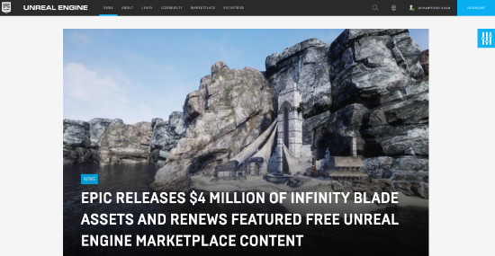

- Go to Personal

- Choose connected Accounts

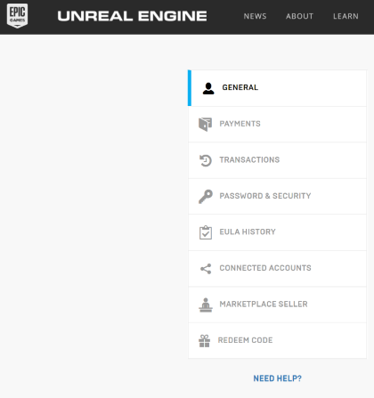

- Finally, connect to GitHub Account

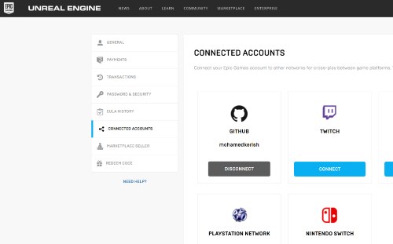

##### Downloading and Compiling Unreal Engine version 4.22

```console
git clone --depth=1 -b 4.22 https://github.com/EpicGames/UnrealEngine.git ~/UnrealEngine_4.22
```

```console
cd ~/UnrealEngine_4.22
```

```console
./Setup.sh && ./GenerateProjectFiles.sh && make
```

#### ROS Installation

The ROS version that would be installed is ROS-Kinetic, which only supports Ubuntu 16.04 Xenial. The installation and compilation steps are as follows:

##### Setting-up your computer to accept software from packages.ros.org

```console
sudo sh -c 'echo "deb http://packages.ros.org/ros/ubuntu $(lsb_release -sc) main" > /etc/apt/sources.list.d/ros-latest.list'
```

##### Setup your keys

```console
sudo apt-key adv --keyserver 'hkp://keyserver.ubuntu.com:80' --recv-key C1CF6E31E6BADE8868B172B4F42ED6FBAB17C654
```

##### Installation

```console
sudo apt-get update
```

##### Desktop-Full Install

This one is recommended, as it includes ROS, rqt, rviz, robot-generic libraries, 2D/3D simulators, navigation and 2D/3D perception

```console
sudo apt-get install ros-kinetic-desktop-full
```

##### ROSdep Initialization

This would enable easy installation of system dependencies and to run some core components in ROS

```console
sudo rosdep init
```

```console
  rosdep update
```

##### Environment Setup

This would automatically add the ROS environment variables to the bash session every time a new shell is launched

```console
echo "source /opt/ros/kinetic/setup.bash" >> ~/.bashrc               
```

```console
source ~/.bashrc                 
```

##### Extra Dependencies Installation

Until now, the needed dependencies were installed to run the Core ROS packages, yet to create and manage your own workspaces, various tools and requirements that are distributed separately need to be installed, so to install these dependencies 

```console
sudo apt install python-rosinstall python-rosinstall-generator python-wstool build-essential                
```

#### Carla-Ros Bridge package Installation

The installed ROS package aims at providing a simple ROS-bridge for Carla Simulator and the setup must be done through creating a catkin Workspace and installing Carla-Ros Bridge package. It is advisable to do the whole compilation inside the Unreal Engine_4.22 file

##### Setup folder structure

```console
mkdir -p ~/carla-ros-bridge/catkin_ws/src                 
```

```console
cd ~/carla-ros-bridge             
```

```console
git clone https://github.com/carla-simulator/ros-bridge.git              
```

```console
cd catkin_ws/src 
```

```console
ln -s ../../ros-bridge          
```

```console
source /opt/ros/kinetic/setup.bash         
```

```console
cd ..         
```

##### Install Dependencies 

Make sure one more time that all the required ROS dependencies were installed

```console
rosdep update         
```

```console
rosdep install --from-paths src --ignore-src -r      
```

##### Build

```console
catkin_make         
```

#### Carla Installation

The final procedure is to clone Carla from GitHub and install it. Doing the whole compilation inside the `Unreal Engine_4.22` file is necessary

##### Clone from Repository

```console
git clone https://github.com/carla-simulator/carla         
```

```console
sudo apt-get install aria2       
```

The upcoming command would take so much time, so it is advisable to install the `aria2` dependency at first.

##### Update Carla

The next step is to open the cloned Carla file from terminal and run this command

```console
./Update.sh     
```

##### Set Environment Variable 

It must be set in order for Carla to find Unreal Engine’s installation folder

```console
export UE4_ROOT=~/UnrealEngine_4.22     
```

##### Compile the simulator and launch Unreal Engine’s Editor

```console
make launch    
```

If the Carla-Unreal Editor starts to initialize and suddenly, this error shows up

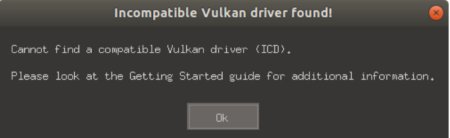

it is advisable in this case to go to `Additional Drivers`, and select the Nvidia Proprietary Driver instead of the Nouveau open-source Driver

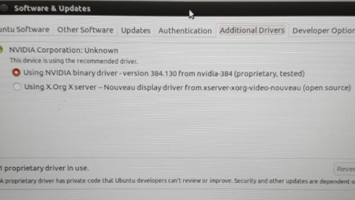

Then type in the `make launch` command again, and the Carla-Unreal Editor will start the Initialization (it will take an hour from this process to finish) 

##### Compile Python API

Run the following command to compile the Python API module responsible for running the Python examples

```console
make PythonAPI        
```

##### Create a packaged version

The last step and the most important one is to compile everything and create a packaged version able to run without UE4 Editor 

```console
make package     
```

This command will take up to two hours to finish and in order to make sure that everything was compiled successfully, this should be the final message

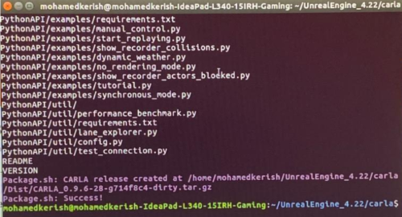

### Carla-ROS Bridge

#### Start the ROS Bridge

##### Start the ROS Bridge

- Open the Unreal Engine File &rarr; Carla &rarr; Unreal &rarr; CarlaUE4 &rarr; LinuxNoEditor

- Open the terminal from `LinuxNoEditor` the and run the simulator inside it using the following command

```console
./CarlaUE4.sh -windowed -ResX=320 -ResY=240
```

Where ResX and ResY represents the dimensions of the window

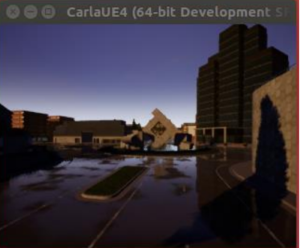

##### Egg-File Location

Complete path to the egg-file including the egg-file itself, it is located inside the `dist` file inside `Python API`

Unreal Engine File &rarr; Carla &rarr; Unreal &rarr; Python API &rarr; Carla &rarr; dist

```console
export PYTHONPATH=$PYTHONPATH:  <path/to/carla/>/PythonAPI/<your_egg_file>   
```

```console
source ~/carla-ros-bridge/catkin_ws/devel/setup.bash
```
##### ROS Options

- Start the ROS-bridge

```console
roslaunch carla_ros_bridge carla_ros_bridge.launch 
```

- Start the ROS-bridge together with RVIZ

```console
roslaunch carla_ros_bridge carla_ros_bridge_with_rviz.launch 
```

- Start the ROS-bridge together with an example ego vehicle

```console
roslaunch carla_ros_bridge carla_ros_bridge_with_example_ego_vehicle.launch 
```

For ROS installation verification purposes, the ROS-bridge together with RVIZ (second option) was chosen to carry-out the upcoming example. After making the ROS connection, the RVIZ window will open up and inside, camera images, sensor data and odometry of information of every vehicle can be reached and can be compared with the carla simulator in terms of accuracy.

##### Verification Case

In order to create a real case simulation, `python API examples` are used to add sensors and spawn characters, for example, vehicles, and pedestrians. From `Examples`, open terminal:

Unreal Engine File &rarr; Carla &rarr; Unreal &rarr; Python API &rarr; Examples

```console
./spawn_npc.py -n (number of spawned characters)
```

n 80 was used in this example.

If the pygame dependency did not work out, run the following command

```console
sudo apt-get install python-pygame
```

##### Python API Example

Finally, run any of the `python API examples` inside a new terminal and manual control was chosen in this case

```console
./manual_control.py
```

Finally, the pygame window will appear, which allows for the change of sensors and manual control by the user and on the top the Frames per Second for the server and the client are shown

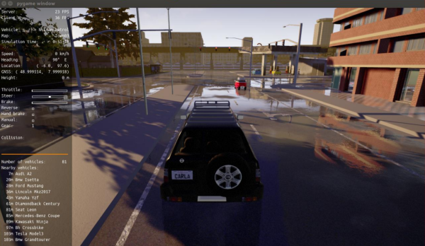

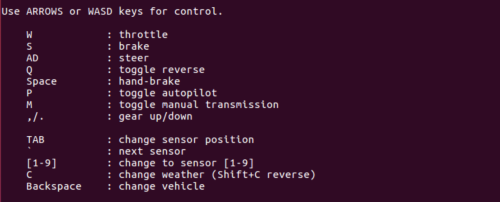

As shown, the autopilot mode (Autonomous Driving) can be activated through pressing P and accordingly, camera images are accessible on RVIZ window and accordingly, the Carla-ROS connection is obtained

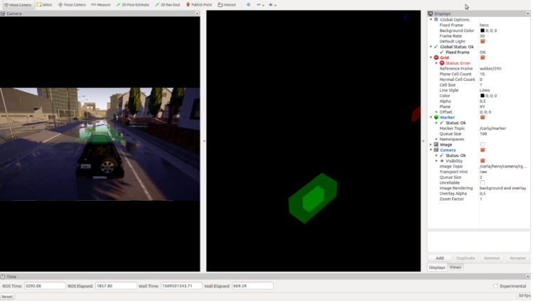

### MATLAB-ROS

In the preceding part, the bridge was there to connect between the Carla world and ROS. In the upcoming part, the focus would be on creating a connection between MATLAB and ROS in order to send data to Simulink using the ROS Custom Messages Interface.

#### Required add-ons Installation 

##### ROS Toolbox 

For MATLAB and Simulink users of version R2019B, a new version of ROS Toolbox has been created, providing an interface connecting MATLAB and Simulink with ROS, enabling the user to create a network of ROS nodes.

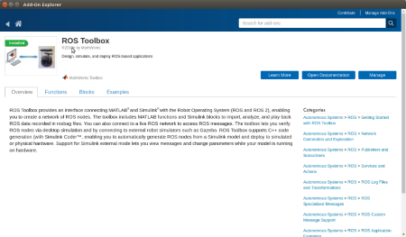

##### ROS Toolbox interface for ROS Custom Messages

The Custom Messages Interface allows the user to define his own custom ROS message within MATLAB and Simulink to communicate with other nodes in the ROS network.

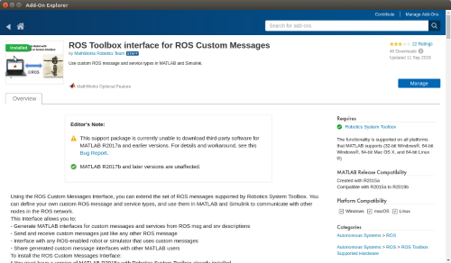

#### Create Custom Messages for Carla

##### Install necessary files to create Custom Messages

- Clone the Carla_msgs file from Gitlab repository and unzip it inside ROS-bridge folder 

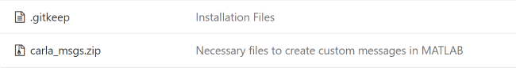

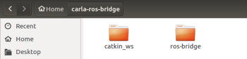

- In order to create custom messages for Carla, the `rosgenmsg` command, which is a function of ROS toolbox interface for ROS custom messages and inside the command type in the location of the ROS bridge directory and accordingly, `matlab_gen` file is created inside ROS bridge folder

```matlab
rosgenmsg () ;
```

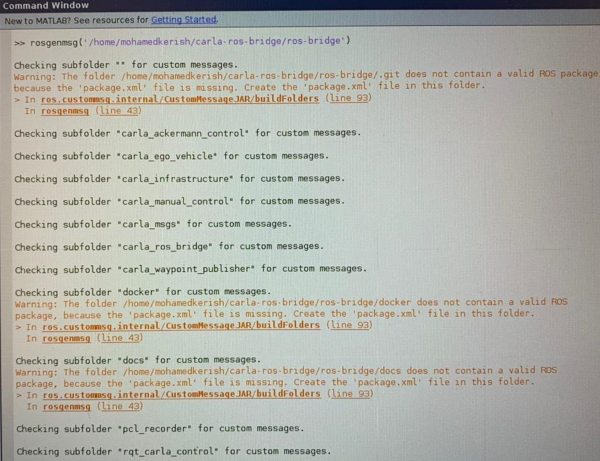

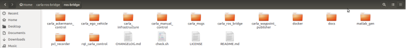

##### Steps to use Custom Messages

- Edit `javaclasspath.txt` and add the following file locations as new lines and save the file in the end

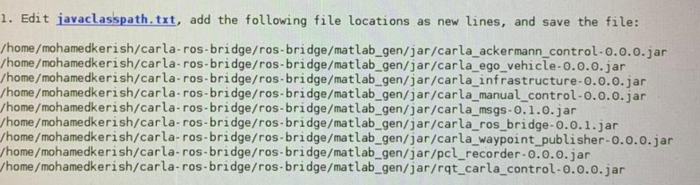

- Create new file

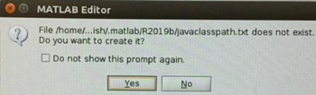

- Add file locations

```matlab
/home/mohamedkerish/carla-ros-bridge/ros-bridge/matlab_gen/jar/carla_ackermann_control-0.0.0.jar
/home/mohamedkerish/carla-ros-bridge/ros-bridge/matlab_gen/jar/carla_ego_vehicle-0.0.0.jar
/home/mohamedkerish/carla-ros-bridge/ros-bridge/matlab_gen/jar/carla_infrastructure-0.0.0.jar
/home/mohamedkerish/carla-ros-bridge/ros-bridge/matlab_gen/jar/carla_manual_control-0.0.0.jar
/home/mohamedkerish/carla-ros-bridge/ros-bridge/matlab_gen/jar/carla_msgs-0.1.0.jar
/home/mohamedkerish/carla-ros-bridge/ros-bridge/matlab_gen/jar/carla_ros_bridge-0.0.1.jar
/home/mohamedkerish/carla-ros-bridge/ros-bridge/matlab_gen/jar/carla_waypoint_publisher-0.0.0.jar
/home/mohamedkerish/carla-ros-bridge/ros-bridge/matlab_gen/jar/pcl_recorder-0.0.0.jar
/home/mohamedkerish/carla-ros-bridge/ros-bridge/matlab_gen/jar/rqt_carla_control-0.0.0.jar ;
```

- The next step is to add the Custom Message folder to the MATLAB path through executing the following command lines in MATLAB

```matlab
addpath('/home/mohamedkerish/carla-ros-bridge/ros-bridge/matlab_gen/msggen')
savepath
```

  However, while executing this command, an error message showed up

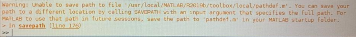

So, in order to avoid such an error, the user has to the properties of the `pathdef.m` file through using this command inside the terminal

```console
sudo nautilus
```

which will allow the user to open a file explorer with root access, giving him the permission to change the properties of the file from read only to read and write and the steps are as follows:

- A new file explorer will open up

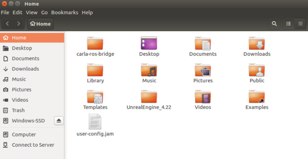

- Choose the `pathdef.m` file

usr &rarr; local &rarr; MATLAB &rarr; R2019b &rarr; toolbox &rarr; local &rarr; pathdef.m

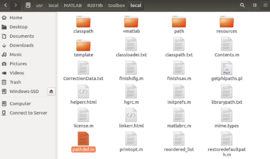

- Choose Permissions

  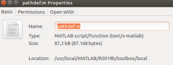

- Change access from `Read only` to `Read and Write` 

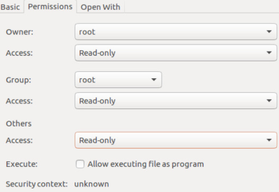

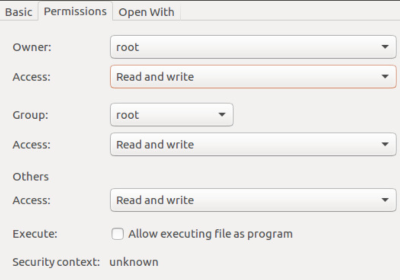

- After executing the previous steps, use the `addpath` command again

- Make sure that the Custom Messages for Carla were added in MATLAB use the following command
```matlab
rosmsg list ;
```

If Carla messages are seen in that list, user should see these messages in the Simulink ROS blocks.

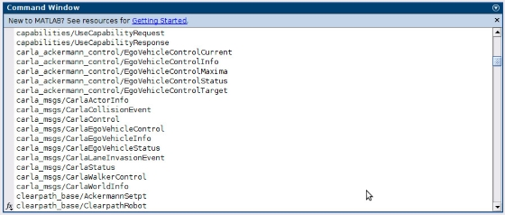

The next step is to check the ROS blocks inside Simulink through selecting `Library Browser`

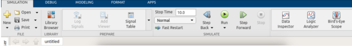

And accordingly, the ROS blocks will show up and can be selected inside the Simulink project as shown 

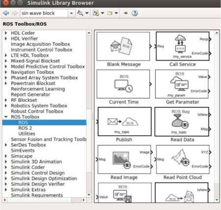

##### Types of Blocks

The following ROS blocks would be mainly used in order to extract Sensor Data and images from Carla and model them in Simulink

- Subscribe Block is mainly used to receive messages from ROS network

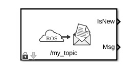

- Read Point Cloud block is used to extract point cloud data from ROS point cloud message `LIDAR`

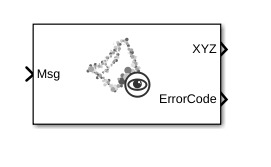

- Publish block is used to send messages to a ROS network

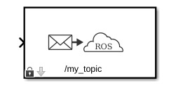

- Read Image block is used to extract image signal from ROS image messages (RGB, Semantic Segmentation and Depth)

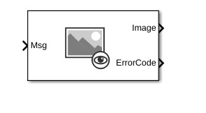

### Proof of Concept

This example is set in order to make sure that the interface between Carla and Simulink is plausible and Sensor Data can be exchanged and modelled on Simulink using the ROS bridge via ROS Custom Messages. In this example, most of the procedures that were written in the `Carla-ROS Bridge` section would be executed and the ROS Blocks, shown in the `Create Custom Messages for Carla` section will be used in order to create a model on Simulink. 

At first, the steps done in the `Start ROS Bridge` part have to be done:

- Run the Simulator

- Locate the Egg-file

- Choose one of the ROS options and for this proof of concept, the third option would be chosen `Start the ROS-bridge together with an example ego vehicle`

- Directly, after following these steps, the Carla world would be initialized with the Ego-Vehicle being there

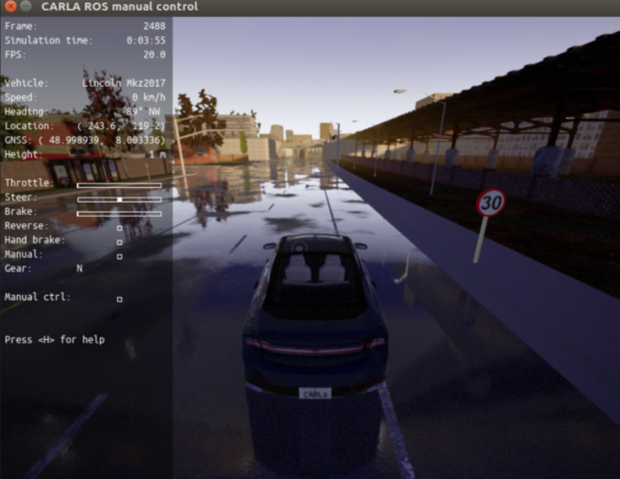

- Spawn Vehicles and characters to have more of a dynamic environment

- Customization of the number of sensors, their types and their locations on the vehicle from the `Sensors.json` file
 
  Carla-ros-bridge &rarr; ros-bridge &rarr; carla_ego_vehicle &rarr; config &rarr; sensors.json

```json
{
    "sensors": [
        {
            "type": "sensor.camera.rgb",
            "id": "front",
            "x": 2.0, "y": 0.0, "z": 2.0, "roll": 0.0, "pitch": 0.0, "yaw": 0.0,
            "width": 800,
            "height": 600,
            "fov": 100,
            "sensor_tick": 0.05
        },
        {
            "type": "sensor.camera.rgb",
            "id": "view",
            "x": -4.5, "y": 0.0, "z": 2.8, "roll": 0.0, "pitch": -20.0, "yaw": 0.0,
            "width": 800,
            "height": 600,
            "fov": 100,
            "sensor_tick": 0.05
        },
	{
            "type": "sensor.camera.depth",
            "id": "frontd",
            "x": 2.0, "y": 0.0, "z": 2.0, "roll": 0.0, "pitch": 0.0, "yaw": 0.0,
            "width": 800,
            "height": 600,
            "fov": 100,
            "sensor_tick": 0.05
        },
	{
            "type": "sensor.camera.depth",
            "id": "viewd",
            "x": -4.5, "y": 0.0, "z": 2.8, "roll": 0.0, "pitch": -20.0, "yaw": 0.0,
            "width": 800,
            "height": 600,
            "fov": 100,
            "sensor_tick": 0.05
        },
	{
            "type": "sensor.camera.semantic_segmentation",
            "id": "fronts",
            "x": 2.0, "y": 0.0, "z": 2.0, "roll": 0.0, "pitch": 0.0, "yaw": 0.0,
            "width": 800,
            "height": 600,
            "fov": 100,
            "sensor_tick": 0.05
        },
	{
            "type": "sensor.camera.semantic_segmentation",
            "id": "views",
            "x": -4.5, "y": 0.0, "z": 2.8, "roll": 0.0, "pitch": -20.0, "yaw": 0.0,
            "width": 800,
            "height": 600,
            "fov": 100,
            "sensor_tick": 0.05
        },
        {
            "type": "sensor.lidar.ray_cast",
            "id": "lidar1",
            "x": 0.0, "y": 0.0, "z": 2.4, "roll": 0.0, "pitch": 0.0, "yaw": 0.0,
            "range": 5000,
            "channels": 32,
            "points_per_second": 320000,
            "upper_fov": 2.0,
            "lower_fov": -26.8,
            "rotation_frequency": 20,
            "sensor_tick": 0.05
        },
        {
            "type": "sensor.other.gnss",
            "id": "gnss1",
            "x": 1.0, "y": 0.0, "z": 2.0
        },
        {
            "type": "sensor.other.collision",
            "id": "collision1",
            "x": 0.0, "y": 0.0, "z": 0.0
        },
        {
            "type": "sensor.other.lane_invasion",
            "id": "laneinvasion1",
            "x": 0.0, "y": 0.0, "z": 0.0
        }
	
    ]
}
 ;
```
After following these steps, the Carla world is set-up and now interfacing with the ROS and the next step is to connect this world to Simulink using the ROS blocks to create a co-simulation model in which sensor data and can obtained and visualized while the vehicle is moving autonomously.

- The first model created is the Vehicle Control model; it consists of several separate building blocks that have several functionalities in order to obtain a certain output, for example, Point cloud data from Lidar, RGB images and Semantic Segmentation from Camera Sensor, while being capable of shifting between Manual and Automatic Control through enabling either Autopilot or Manual Control. In order, to understand each model separately, the user has to double click any of these models to see their building blocks and how the Carla-ROS custom messages are used as a networking platform between Simulink and Carla.

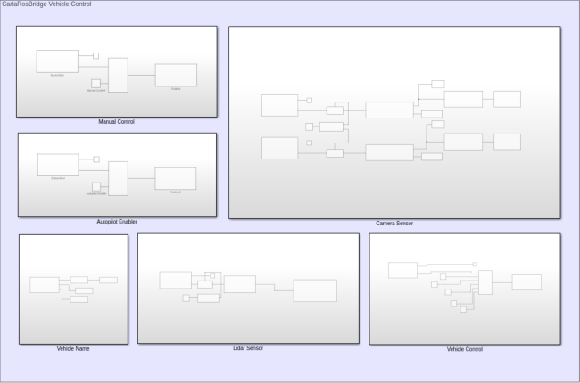

- The second model created in Simulink using the ROS blocks is capable of obtaining RGB images and Semantic Segmentation through obtaining a message from ROS network and forwarding it to the read image block, and also, the number of frames per second (FPS) can be displayed. Moreover, it is easy to choose between either displaying RGB images or Semantic Segmentation by just inputting a Boolean value, for example, `0` for case [0] to obtain RGB display and `1` for obtaining Semantic Segmentation
  
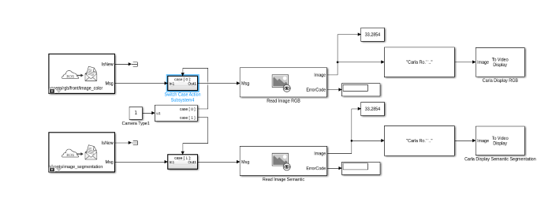

- Point Cloud Display model


- Enabling the visualizations sensors and shifting between Autopilot and manual control modes can be done using the Dashboard 

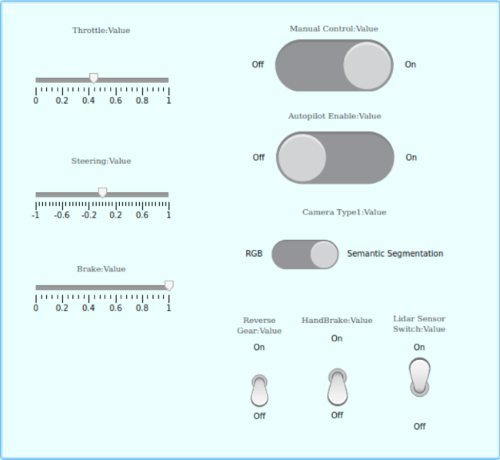

- The fourth model created was used in order to switch the vehicle from the autonomous mode to manual control inside Simulink through using the Publish block, which sends the enabling message to ROS network

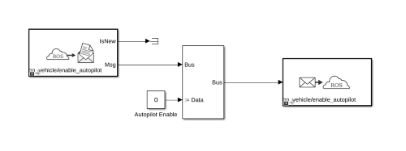

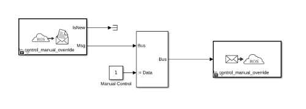

- If the manual control is enabled through choosing the value `1` inside the manual control block or by switching on the manual control switch located in the dashboard, the vehicle would be manually controlled through choosing certain values for throttling, steering and braking from the Dashboard

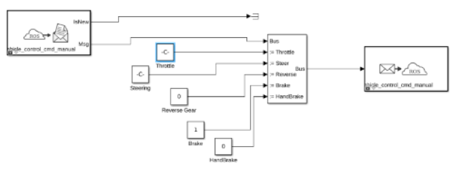

- Finally, after creating the models inside Simulink, for the co-simulation to take place, press on `RUN` button

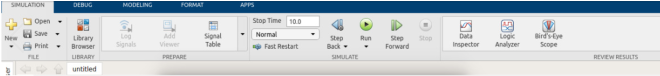

- These windows would be obtained in the end, Semantic Segmentation, RGB and Lidar

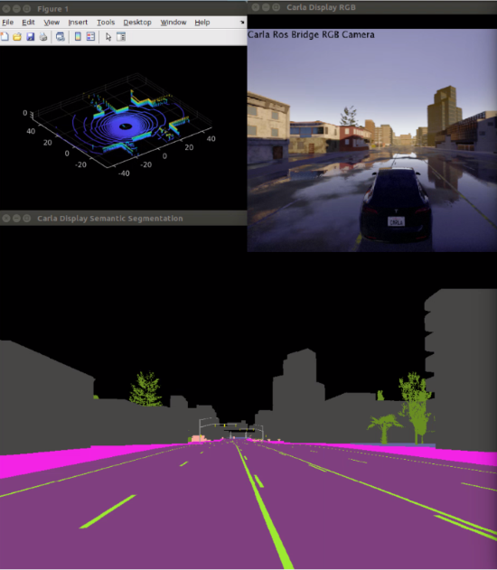

## Writing your first MATLAB script for Carla using the Python interface

This section introduces the following new concepts.

1. Writing script in MATLAB to connect to Carla
2. Creating actors with specified attributes
3. Freeing up allocated resources from the server (Carla)

Before we begin, let me explain the approach we will be using to connect to Carla. If you have used Carla before, you will know that Carla comes with a Python API which is the default way of communicating with it. A cool feature of MATLAB is that it allows you to use python from MATLAB itself. We will be using this exact python interface from MATLAB.

Before writing some code, it is necessary to know how Carla works. Basically, Carla divides everything into 3 main types according to their [website](https://carla.readthedocs.io/en/latest/python_api_tutorial/):

- **Actor:** Actor is anything that plays a role in the simulation and can be moved around, examples of actors are vehicles, pedestrians, and sensors.
- **Blueprint:** Before spawning an actor you need to specify its attributes, and that's what blueprints are for. We provide a blueprint library with the definitions of all the actors available.
- **World:** The world represents the currently loaded map and contains the functions for converting a blueprint into a living actor, among other. It also provides access to the road map and functions to change the weather conditions.

So, without further ado, boot up your MATLAB and type in the following commands:

```matlab
port = int16(2000);
client = py.carla.Client('localhost', port);
client.set_timeout(2.0);
world = client.get_world();
```

Carla operates over network. Basically, `port = int16(2000)` defines the port over which Carla broadcasts all the data by default. Then, we create a client to connect to the main server (Carla Simulator) and set a timeout of 2 seconds. After successfully connecting, we retrieve the world. This contains all the static information about the world. Next, we want to spawn some vehicle in Carla. Write the following commands:

```matlab
blueprint_library = world.get_blueprint_library();
car_list = py.list(blueprint_library.filter("model3"));
car_bp = car_list{1};
spawn_point = py.random.choice(world.get_map().get_spawn_points());
tesla = world.spawn_actor(car_bp, spawn_point);
tesla.set_autopilot(true);
```

After getting the world, we scan the blueprints and filter out the required cars. For this example, we chose Tesla Model 3. This will return a list that matches the query and we can choose any vehicle from that list. The next step is to define the point at which the vehicle should appear. Let's select a random location and spawn the actor. At the moment, we will set it to autopilot. The vehicle should now appear in Carla. You can go and take a look :smile:. That's all that you need to do. But before you quit, remember to free the resources. This can be done by destroying all the actors that we spawned earlier. For that, use the following command:

```matlab
tesla.destroy();
```

Now, if you want to use a script rather than the terminal, the whole code is here:

```matlab
port = int16(2000);
client = py.carla.Client('localhost', port);
client.set_timeout(2.0);
world = client.get_world();

blueprint_library = world.get_blueprint_library();
car_list = py.list(blueprint_library.filter("model3"));
car_bp = car_list{1};
spawn_point = py.random.choice(world.get_map().get_spawn_points());
tesla = world.spawn_actor(car_bp, spawn_point);
tesla.set_autopilot(true);

while True
    % Nothing here
end
```

And when you stop the script, remember to use `tesla.destroy()` to clear the resources.

## Diving deeper: Running the Examples

You should have a decent idea now on how to do basic things from the python API. We will be discussing on how to develop more features onto that but thats not all. We provide an alternative approach as well using [ROS](https://www.ros.org/) which is pretty much the standard for Robotics worldwide. Most of the example will be showcased for both the approaches. The Python API allows access to the low level features whereas ROS is directed more towards the high level abstraction of these models. The end contains a [comparison](#comparison) between both the approaches and their current limitations.

### Adaptive Cruise Control

#### Python Interface: ACC

> To go directly to the source code, [click here](Proof%20Of%20Concept/Python%20API/Examples/1_AdaptiveCruiseControl)

This section introduces the following new concepts.

1. Writing Simulink classes for Carla
2. Integrating these classes with Simulink System block
3. Fetching data from Carla regarding actors

To unlock the true potential of MATLAB, the examples will mostly be directed towards **Simulink** from this point onwards. The basic aim is to move a step forward and exchange some data between Carla and Simulink. The example is based on [`Adaptive Cruise Control System Using Model Predictive Control`](https://www.mathworks.com/help/mpc/ug/adaptive-cruise-control-using-model-predictive-controller.html). We will be modifying the example by replacing the `Lead Car` with a car from Carla and simulating the behavior of Ego car in Simulink. To open up the example, type in the following:

```matlab
openExample('mpc/AdaptiveCruiseControlExample')
```

You can now see the Simulink model. Lets start writing some code. To use the code that we write in MATLAB, we will be using the `MATLAB System` block to access it in Simulink. We will start by writing the a custom class in MATLAB. We will be calling this class `CarlaEnvironment`:

```matlab
classdef CarlaEnvironment < matlab.System & matlab.system.mixin.Propagates
    % Add further stuff here
end
```

This class inherits from `matlab.System` class which is basically required to use the `MATLAB System` block in Simulink. The other class `matlab.system.mixin.Propagates` allows us to specify more details about the input and output data. This is necessary as Simulink does not have any information about what sort of input and output data to expect at the run time. Following are some of the attributes about the output data the we will need to specify.

- Size
- Data type
- Fixed size
- Possibility for complex numbers

Worry not, there are built in methods to do that. What is even better is that you can add these methods from the GUI as well. We will discuss this later. First, lets create a state variable to store the car:

```matlab
properties(Access = private)
    car;
end
```

Save the file with the same name as the class name, i.e. `CarlaEnvironment`. The next step is to spawn the vehicle. In Simulink, you can set the initial state of the model and then on every iteration update and perform some actions. For that, we need to define these methods. In the `Editor` tab, click on insert property and select `setupImpl` and `stepImpl`


This will create empty fields for us to fill in. We will start by defining the startup behavior first. This part looks almost exactly the same as first [script](#writing-your-first-matlab-script-for-carla-using-the-python-interface) that we wrote. Define `setupImpl` as follows:

```matlab
function setupImpl(obj)
    port = int16(2000);
    client = py.carla.Client('localhost', port);
    client.set_timeout(10.0);
    world = client.get_world();

    % Spawn Vehicle
    blueprint_library = world.get_blueprint_library();
    car_list = py.list(blueprint_library.filter("model3"));
    car_bp = car_list{1};
    spawn_point = py.random.choice(world.get_map().get_spawn_points());
    obj.car = world.spawn_actor(car_bp, spawn_point);
    obj.car.set_autopilot(true);

end
```

The only thing that changed is that we want to retain the car in the class. For that purpose, we use `obj` prefix to make sure that it is a class variable. This corresponds to the name of the first argument `setupImpl` takes. Moving on to the second method, lets discuss what we would like to do every iteration. By looking at the [example](https://www.mathworks.com/help/mpc/ug/adaptive-cruise-control-using-model-predictive-controller.html), we see that we need to publish the location of the vehicle along with its velocity. Thus, we will implement our `stepImpl` as follows:

```matlab
function [x_position, x_velocity] = stepImpl(obj)
    pause(0.001);
    x_position = obj.car.get_location().x;
    x_velocity = obj.car.get_velocity().x;

end
```

The code is pretty simple. We add the `pause` command to manually slow down the simulation as it runs really fast. The final step in writing the class is to add the details about the output and release the resources. Once again, go to the `Editor` tab, click on insert property and select `isOutputComplexImpl`, `getOutputSizeImpl`, `getOutputDataTypeImpl` and `isOutputFixedSizeImpl` as shown.


The output size of both distance and velocity is `[1 1]` with data type `double`. They do not become complex and neither do they change their output size. The implementations are as as follows:

```matlab
function [distance, velocity] = isOutputComplexImpl(~)
    distance = false;
    velocity = false;
end

function [distance, velocity] = getOutputSizeImpl(~)
    distance = [1 1];
    velocity = [1 1];
end

function [distance, velocity] = getOutputDataTypeImpl(~)
    distance = 'double';
    velocity = 'double';
end

function [distance, velocity] = isOutputFixedSizeImpl(~)
    distance = true;
    velocity = true;
end
```

To destroy the car when the simulation ends, add the following method:

```matlab
methods(Access= public)
    function delete(obj)
        % Delete the car from the Carla world
        if ~isempty(obj.car)
            obj.car.destroy();
        end
    end
end
```

To get the full code, click [here](Proof%20Of%20Concept/Python%20API/Examples/1_AdaptiveCruiseControl/CarlaEnvironment.m). We are done with implementing the class. We just need to import it to Simulink. We will be now modifying the example of Adaptive Cruise Control. Open it by typing `openExample('mpc/AdaptiveCruiseControlExample')`. Delete the lead car blocks and from the library, add `MATLAB System` block under _User defined functions_.


Double click the system block and select the class we just wrote.


Click **OK**. Double click it again and change the execution to interpreted. Finally, connect the distance and velocity to their respective ports. It should look something like the image below. Note that the constants have been manually replaced in the blocks.


Finally, run the simulation in Simulink and you should see the results. For more detail on running the simulation and interpreting the results, view the video below.


##### Lane Following 

- After the Proof of concept, Lane Following case was created. The model uses Semantic Segmentation in order to detect lanes, also, as in the previous case of a Lidar, a new block named `Lane Detection` was created using `Matlab.System`class and a lane detection Algorithm was used. In the Algorithm, it was specified that whenever the vehicle detects a lane using semantic segmentation, a spline must be drawn on this lane showing in which direction the vehicle has to adjust itself

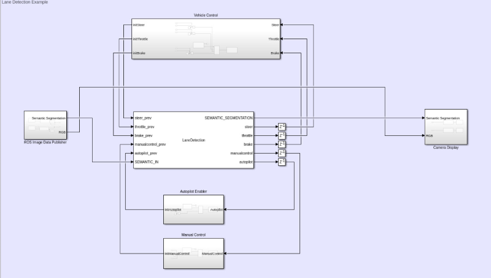

```matlab
 % Update the spline history ~ every .2 seconds. A very high FPS
            % would polute the spline fitting
            if cputime - obj.push_back_time > .2
                
                %Delete the oldest element in the array
                obj.history_array(:,1) = [];
                
                %Most recent history weight
                weight = 1.25;
                
                %Average of the steer since the last update
                steer = (obj.steer_window_avg + steer)/(obj.frames_since_last_update + 1);

                %Add to the histroy
                obj.history_array = [obj.history_array, [cputime;steer]];

                %Pre-processing for the curve fitting
                [timeData, steerData] = prepareCurveData( obj.history_array(1,:),...
                                                          obj.history_array(2,:));


                obj.history_array(end) = obj.history_array(end) * weight;

                %Fit a smoothing spline to the data
                obj.steer_spline = fit( timeData, steerData, 'smoothingspline', ...
                                        'Normalize', 'on', 'SmoothingParam',0.95);

                obj.history_array(end) = obj.history_array(end) / weight;
                
                obj.steer_window_avg = 0;
                obj.frames_since_last_update = 0;
                
                obj.push_back_time = cputime;
                
            else
                 % If not yet time to update, keep track of the steer values
                 % in this time slot
                obj.steer_window_avg = obj.steer_window_avg + steer;
                obj.frames_since_last_update = obj.frames_since_last_update + 1;
            end
            % Predict and steer the car
            steer = obj.steer_spline(cputime + dt/2);
            
            throttle = single(throttle);
            steer = single(steer);
            brake = single(brake);
            manualcontrol = boolean(manualcontrol);
            autopilot = boolean(autopilot);

end
```
- The main focus of the lane detection model is to be able to control the vehicle and manuever it from inside Simulink, so the autopilot was initialized with `0`, so after using the logic gate or to compare between the values, the autopilot would be disabled. On the contrary, the manual control would be initialized with a value of `1`, so the output of the logic gate would be one and the vehicle would be controlled manually 

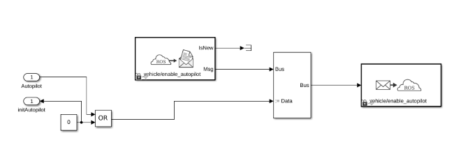

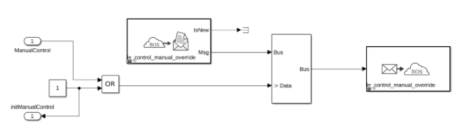

- While controlling the vehicle manually, according to its position with respect to the lanes, the steer, throttle and brake values would be updated by summing them up to their initial values and accordingly, the vehicle can change its position

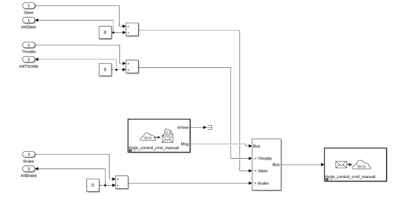

- After running this model on Simulink, these windows would be displayed, the first would be the RGB Camera Display, the second is Semantic Segmentation Display, and the last window is showing the update of the splines drawn in green over the white lanes after getting detected with Semantic Segmentation

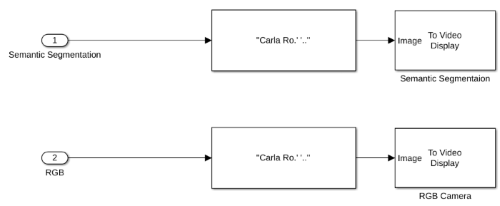

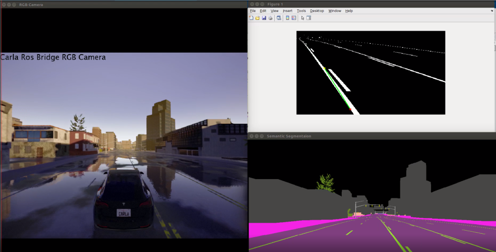


### Getting Lidar data

#### Python Interface: Lidar

> To go directly to the source code, [click here](Proof%20Of%20Concept/Python%20API/Examples/2_Lidar)

This section introduces the following new concepts.

1. Creating [sensors](https://carla.readthedocs.io/en/latest/cameras_and_sensors/) in general and specifically Lidar
2. Using our custom functions that automatically write python scripts in the backend
3. Visualizing the Lidar data in MATLAB

For autonomous driving, Lidar is pretty much a standard. It allows the car to view its surroundings using a point cloud. Carla also allows to simulate it by using ray cast (think of it as a laser) and generating the 3D points. This example will be in MATLAB as we can visualize it pretty fast. Most of the code is similar to the examples provided earlier. For this example, we will add sensors as well, basically the Lidar. For transferring the data between Carla and Simulink, Python will used. The good part is that we already provide functions that do it for you. Depending on the sensors and the settings chosen, it automatically generates the Python files behind the scenes.

Launch MATLAB, initialize the Carla environment and add some vehicle to the Carla world (if unsure, look [here](#writing-your-first-matlab-script-for-carla-using-the-python-interface)). The next step is to add the sensor. It is typically attached to an actor. As sensor is also an actor, the way it is spawned is similar to vehicle. We start by getting the blueprints from the world and filtering it for Lidar sensor:

```matlab
blueprint = world.get_blueprint_library().find('sensor.lidar.ray_cast');
```

Before spawning the Lidar, we can change the attributes. A see the complete list of attributes available, go to the Carla [documentation](https://carla.readthedocs.io/en/latest/cameras_and_sensors/#sensorlidarray_cast). Some attributes that we will like to change are:

- Number of points generated per second
- How far the Lidar can see
- Time for one complete rotation
- Field of View
- Sensor location relative to the actor it will be attached to

To specify these attributes, add the following:

```matlab
blueprint.set_attribute('points_per_second', '140000');
blueprint.set_attribute('range', '2500');
blueprint.set_attribute('sensor_tick', '0.1');
blueprint.set_attribute('upper_fov', '45.0')
blueprint.set_attribute('lower_fov', '-30.0')
transform = py.carla.Transform(py.carla.Location(pyargs('x',0.8, 'z',1.7)));
```

As Python allows keyword arguments, it is possible to instantiate specific values. We can specify these keys using the MATLAB command `pyargs`. The attributes are exactly in the same order as enumerated in the aforementioned list. The next thing is to choose the actor we want to attach this sensor to. For us, that is `tesla`:

```matlab
sensor = world.spawn_actor(blueprint, transform, pyargs('attach_to',tesla));
```

The way Carla publishes the sensor data is through callback functions. Now, here is the tricky part. As Python and MATLAB run asynchronously, it not so straight forward to exchange data between them. The solution for this is to make globally scoped variables on the Python side and let MATLAB read from it asynchronously. This way, the Python part is responsible for writing to the buffer (variable) where as MATLAB just reads from it.

Fortunately, we provide a function that does everything for you. The function looks signature looks like this:

```matlab
function pyModule = sensorBind(sensor, file_name, sensor_mode, var_name)
```

Basically, `sensor` is the sensor object we created in the block before. It is required to bind it to the callback function. The argument `file_name` specifies the generated python file name that contains the callback function. Depending on the sensor chosen, `sensor_mode` allows different outputs formats. For example, if you have a RGB sensor, we provide an extra mode to get the grayscale image. To use the default mode, we use the name of the sensor itself. More detail can be found [here](#sensor-binding-for-python). The data that the sensor returns need to be stored somewhere. The parameter `var_name` allows us to give name to that variable. The function returns a module that can be queried later for the value of `var_name`. So, for this example:

```matlab
moduleLidar = sensorBind(sensor, 'lidar_file', 'lidar', 'array');
```

The `sensor_mode` is chosen to be `lidar` as it only has a single mode. The final part is to get the Lidar data, visualize it and cleanup the resources at the exit.

```matlab
player = pcplayer([-25 25],[-25 25],[-10 10]);

while isOpen(player)
     view(player, single(py.getattr(moduleLidar, 'array')));
end

tesla.destroy();
sensor.destroy();
```

Here, we cast the data that we get back from Carla to floats and view them using the point cloud player in MATLAB. To get the full code, click [here](Proof%20Of%20Concept/Python%20API/Examples/2_Lidar/CarlaDataAcquisition.m). Finally, run the simulation and you should see the results. For more detail on running the simulation and interpreting the results, view the video below.


#### ROS Interface: Lidar

- The third model created was for Lidar sensor in order to obtain point cloud data and can be also enabled from the Dashboard that will be explained in the upcoming point. This model works as follows, the subscribe ROS block receives the message from the Carla environment then passed to the Read Point Cloud block to extract point cloud data, yet it was not possible to visualize these point cloud using the Display block in Simulink, so a new block `viewPC` was created with  `Matlab.System` class in order to write a MATLAB code to plot a 3-D point cloud data using the `pcshow()` built-in function

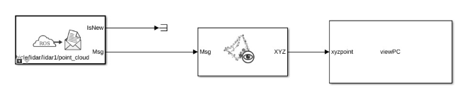

### Getting sensors data in Simulink

#### Python Interface: Multiple Sensors

> To go directly to the source code, [click here](Proof%20Of%20Concept/Python%20API/Examples/3_Carla-Sensors)

This section introduces the following new concepts.

1. Adding multiple sensors in Simulink
2. Visualizing sensors data in real time

Typically for autonomous driving setups, data is obtained from multiple sensors. For this example, we will add RGB sensor, a semantic segmentation sensor and a depth camera with 2 different modes. As all these sensors return images in one form or the other, we first need to specify the resolution. Start by creating a Simulink class as in the [previous section](#python-interface-acc). For the RGB sensor, we will start by filtering the blueprints and tuning some attributes of the camera in the `setupImpl` method:

```matlab
    blueprint = world.get_blueprint_library().find('sensor.camera.rgb');
    blueprint.set_attribute('image_size_x', num2str(obj.width))
    blueprint.set_attribute('image_size_y', num2str(obj.height))
```

Here, the `obj.width` and `obj.height` corresponds to some predefined resolution in the class member variables. The next step is to attach it to the vehicle which is exactly the same as for Lidar:

```matlab
    obj.rgb = world.spawn_actor(blueprint, transform, pyargs('attach_to',obj.tesla));
```

We will store the sensors as well in the class as we need to keep them alive and free them when the code finishes execution. The next step is to bind the sensor. The RGB camera has 2 different modes namely `RGB` and `Grayscale`. For this example, we will select the normal RGB mode:

```matlab
    obj.module_rgb = sensorBind(obj.rgb, "rgb_file", "rgb", "array");
```

For the semantic segmentation sensor, we also have 2 modes. The normal sematic segmentation modes returns a tagged image with tags going from `0 → 12`. This of course is hard to visualize. To do so, we transform the tagged image to RGB as per the [Carla documentation](https://carla.readthedocs.io/en/latest/cameras_and_sensors/#sensorcamerasemantic_segmentation). Start by creating a semantic segmentation sensor and assigning attributes similar to RGB sensor. Then, bind it as follows:

```matlab
    obj.module_ss_rgb = sensorBind(obj.ss_rgb, "ss_rgb", "semantic_segmentation_rgb", "array");
```

Finally, for the depth sensor, there are also 2 modes. The normal mode is `depthRGB` which basically encodes the distance in its RGB channel. The second mode decodes the RGB to distance in meters using the following equation:

```math
1000 \left ( \frac{R + G * 256 + B * 256 * 256}{256 * 256 * 256 - 1} \right ) m
```

Where the `R, G, B` represent the red, green and blue channel respectively of the encoded image. For this example, we will be using both the modes so spawn 2 sensors and bind them as follows:

```matlab
    obj.module_depthRGB = sensorBind(obj.depthRGB, "depthRGB", "depthRGB", "array");
    ...
    obj.module_depth = sensorBind(obj.depth, "depth", "depth", "array");
```

Update the `isOutputComplexImpl`, `getOutputSizeImpl`, `getOutputDataTypeImpl` and `isOutputFixedSizeImpl` methods as described in the [earlier example](#python-interface-acc). The code for the whole class is available [here](Proof%20Of%20Concept/Python%20API/Examples/3_Carla-Sensors/CarlaEnvironment.m). Next, we create a Simulink model to display the results. Just add **Rate Transition** block followed by **To Video Display** block for each output. The scale of the decoded depth camera is out of proportion so add a **Gain** block before the rate transition with a value of $`1/100`$. That is all for this example. For more detail on running the simulation and interpreting the results, view the video below.


### Controlling the Actor

#### Python Interface: Keyboard Control

> To go directly to the source code, [click here](Proof%20Of%20Concept/Python%20API/Examples/4_KeyBoardControl)

This section introduces the following new concepts.

1. Actuating Actors in general and specifically with keyboard

Till now, all examples were related to the sensing part. Next, we move on to actually controlling the car. We will get the RGB sensor data and try to control the car using the keyboard. Set up the Carla environment in MATLAB and attach a RGB sensor to it. For the purpose of getting input from MATLAB, we will create a small figure and get key presses using it. The actor can be queried for its current control parameters using the `get_control` function. For our case, the code would look something like this:

```matlab
control = tesla.get_control();
```

This will return a carla.VehicleControl object. Most interesting attributes of this object are _throttle_ which varies from $`0 → 1`$, _steer_ which varies from $`-1 → 1`$ where $`-1`$ represents extreme left and $`1`$ represents extreme right, _brake_ which varies from $`0 → 1`$ and _reverse_ which is a boolean value. By changing the values of these individual variables, we can maneuver the actor. For example, to change throttle and steer, we can do the following:

```matlab
control.throttle = 1;
control.steer = 0.5;
```

To apply it to the actor:

```matlab
tesla.apply_control(control);
```

For this example, we have mapped different keys to different actions. To view in detail on how to poll for keyboard input, take a look [here](Proof%20Of%20Concept/Python%20API/Examples/4_KeyBoardControl/CarlaDataAcquisition.m). The controls are applied to the actor based on the key pressed. This is basically just an extension of what we just described above and can be found in [process keyboard](Proof%20Of%20Concept/Python%20API/Examples/4_KeyBoardControl/processKeyboard.m). In these scripts, we also pass in `dt`. To explain its purpose, consider 2 computers. Computer A can run the simulation at 100 FPS whereas computer B runs it on 10 FPS. If we have a constant steer in each frame, computer A will end up steering $`10x`$ more than computer B. The variable `dt` takes care of this inconsistency and scales the controls appropriately. For more detail on running the simulation and interpreting the results, view the video below.


#### ROS Interface: Keyboard Control

- The last model created was a separate keyboard unit capable of controlling the vehicle with specific keys while enabling manual control mode

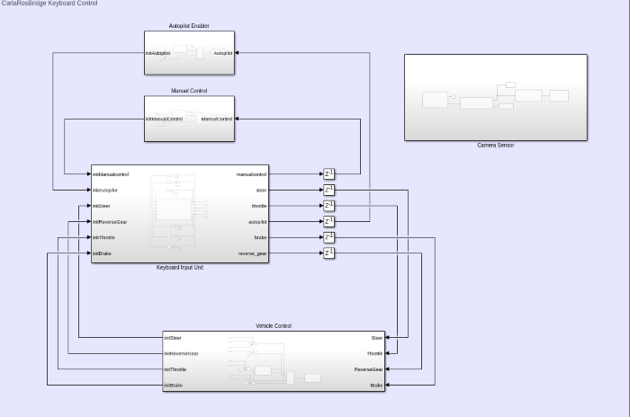

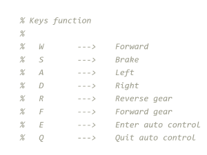

- Similar to the lane Detection model, so the autopilot was initialized with zero, so after using the logic gate or to compare between the values, the autopilot would be disabled. The Manual control was initialized with the value of `1` when `Q` is pressed to quit the auto control
  
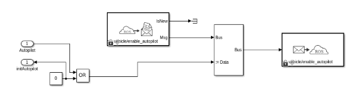


- The interaction between the vehicle control blocks and the keyboard input unit is a form of a loop updating in terms of updating the values for Throttling, steering, braking and for this keyboard model reverse gearing was included. For example, if the car is going to move forward from rest, the initial throttling value would be `0` and as long as the throttling key  `W` is pressed, the throttling values would be updated in the vehicle control model and the new values would be taken from the keyboard input unit.


- Finally, after running this model, these windows would be the output


## Comparison

### Python Interface

#### Pros

- Default language of Carla
- All features available
- Extremely fast especially for sensors data
  - All transformations at C-level

#### Cons

- Requires some knowledge about Python
- Tricky to compile in conjunction with Simulink

### ROS Interface

#### Pros

- High level abstraction of the features
- Visual Modelling

#### Cons

- Limited Features
- Inflexible
- More hardware intensive
- Also uses Python interface of Carla in the backend

## Appendix

### Sensor binding for Python

> All the transformations on the Python side are done at **C level** using the _numpy_ library which makes it extremely fast

We provide support for the auto-generation of the python script for different sensors. The function signature looks like follows:

```matlab
function pyModule = sensorBind(sensor, file_name, sensor_mode, var_name)
```

where,

|**Input**|   |
|---|---|
|sensor|        The sensor object created which needs to be bound to the Python module |
|file_name|     Name of the Python file that will be generated. Must be unique |
|sensor_mode|   Sensors can have multiple modes. For example, RGB camera has grayscale mode as well |
|var_name|      Name of the variable that will store the sensor data |

|**Output**|   |
|---|---|
|pyModule|      Returns a module that can be queried for the sensor data by `py.getattr(pyModule, var_name)`|

For the automatic generation of python scripts, we support the following sensors.

1. RGB Camera
   - Standard RGB:
     - **sensor_mode**: `rgb`
     - **returns**: A C contiguous array of dimension `[height width 3]`. Can be casted to MATLAB compatible type using `uint8(output_array)`
   - Grayscale:
     - **sensor_mode**: `grayScale`
     - **returns**: A C contiguous array of dimension `[height width]`. Can be casted to MATLAB compatible type using `uint8(output_array)`
  
2. Depth Camera
   - Depth Camera RGB:
     - **sensor_mode**: `depthRGB`
     - **returns**: A C contiguous array of dimension `[height width 3]`. Can be casted to MATLAB compatible type using `uint8(output_array)`. The RGB channels can be decoded to distance in meters using:

        ```math
        1000 \left ( \frac{R + G * 256 + B * 256 * 256}{256 * 256 * 256 - 1} \right ) m
        ```

   - Depth Camera Distance:
     - **sensor_mode**: `depth`
     - **returns**: A C contiguous array of dimension `[height width]`. Can be casted to MATLAB compatible type using `double(output_array)`. Each pixel represents the distance in meters of the perceived objects. Calculated using the formula above

3. Semantic Segmentation
   - Tagged Semantic Segmentation:
     - **sensor_mode**: `semantic_segmentation`
     - **returns**: A C contiguous array of dimension `[height width]`. Can be casted to MATLAB compatible type using `uint8(output_array)`. Each pixel has a tag from `0 → 12` which represent:

        |**Value**|**Tag**|**Converted Color**|
        |---:|---|---|
        | 0|Unlabeled|( 0, 0, 0)|
        | 1|Building|( 70, 70, 70)|
        | 2|Fence|(190, 153, 153)|
        | 3|Other|(250, 170, 160)|
        | 4|Pedestrian|(220, 20, 60)|
        | 5|Pole|(153, 153, 153)|
        | 6|Road line|(157, 234, 50)|
        | 7|Road|(128, 64, 128)|
        | 8|Sidewalk|(244, 35, 232)|
        | 9|Vegetation|(107, 142, 35)|
        |10|Car|( 0, 0, 142)|
        |11|Wall|(102, 102, 156)|
        |12|Traffic sign|(220, 220, 0)|

   - Sematic Segmentation RGB:
     - **sensor_mode**: `semantic_segmentation_rgb`
     - **returns**: A C contiguous array of dimension `[height width 3]`. Can be casted to MATLAB compatible type using `uint8(output_array)`. Transformed based on the table above

4. Lidar
   - Point Cloud:
     - **sensor_mode**: `lidar`
     - **returns**: A C contiguous array of dimension `[number_of_points 3]`. Can be casted to MATLAB compatible type using `single(output_array)`. The variable `number_of_points` represents the number of points scanned since the last sensor tick. A single point consists of `[x y z]` coordinates in the world reference frame
