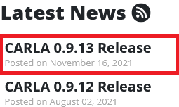
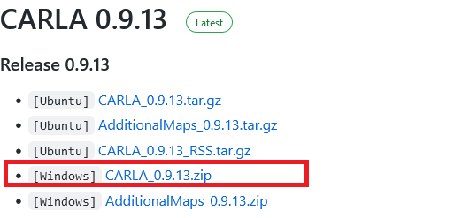

# Carla-Simulink Interface

- [Carla-Simulink Interface](#carla-simulink-interface)
  - [General Note](#general-note)
  - [Requirements](#requirements)
    - [Hardware](#hardware)
    - [Software](#software)
  - [Getting Started](#getting-started)
    - [Using the Python Interface](#using-the-python-interface)
  - [Writing your first MATLAB script for Carla using the Python interface](#writing-your-first-matlab-script-for-carla-using-the-python-interface)
  - [Diving deeper: Running the Examples](#diving-deeper-running-the-examples)
    - [Adaptive Cruise Control](#adaptive-cruise-control)
      - [Python Interface: ACC](#python-interface-acc)
    - [Getting Lidar data](#getting-lidar-data)
      - [Python Interface: Lidar](#python-interface-lidar)
    - [Getting sensors data in Simulink](#getting-sensors-data-in-simulink)
      - [Python Interface: Multiple Sensors](#python-interface-multiple-sensors)
    - [Controlling the Actor](#controlling-the-actor)
      - [Python Interface: Keyboard Control](#python-interface-keyboard-control)
  - [Appendix](#appendix)
    - [Sensor binding for Python](#sensor-binding-for-python)

Carla is an open-source software targeted towards autonomous driving research. It provides a powerful interface to support autonomous driving systems' development, training, and validation. Simulink needs no introduction. It is used widely, especially by engineers, and provides a lot of functionality to assist rapid product development. The primary motivation for the project is to link Simulink to Carla and showcase some examples of how to use the interface.

## General Note

This repository shows how to integrate MATLAB/Simulink with Carla using Python or ROS. This README file demonstrates the Python version only. For a complete dump of instructions, refer to the [other version](README_dump.md). The python version is explored by me while the ROS equivalent is explored by my colleague `Ahmethan Başak`. The complete version is messy due to the merger of 2 different approaches, but I hope that it is still useful.

For demonstration, different sensors are spawned inside Carla while their data is processed in MATLAB/Simulink in real time.


Finally, due to the paid nature of MATLAB licence, I am no longer be able to update the package. The underlying concepts and techniques can be utilized by the users for their needs. Queries are always welcomed regradless.

## Requirements

To run this interface, the following requirements should be met.

### Hardware

As Carla uses [Unreal Engine](https://www.unrealengine.com), the recommended requirements are basically the same, which are as follows.

- 64-bit Windows/Linux/MacOS
- 8-GB RAM or more
- Quad core Intel or AMD processor, 2.5 GHz or faster
- NVIDIA GeForce 470 GTX or AMD Radeon 6870 HD series card or higher
- 10GB of hard drive space for the simulator setup

### Software

To run the interface, the following softwares are required.

- [MATLAB](https://www.mathworks.com/products/matlab.html)
- [Simulink](https://www.mathworks.com/products/simulink.html)
  - [Model Predictive Control Toolbox](https://www.mathworks.com/help/mpc/index.html)
  - [Simulink Control Design](https://www.mathworks.com/help/slcontrol/index.html)
- [Carla](http://carla.org/)
- [Python](https://www.python.org/)
- [ROS](https://www.ros.org/) (only if you want to run the ROS  of the interface)
- [Unreal Engine](https://www.unrealengine.com) (only if you plan to compile everything from scratch)

## Getting Started

### Using the Python Interface

Start by installing [MATLAB](https://www.mathworks.com/products/matlab.html) and [Simulink](https://www.mathworks.com/products/simulink.html). The installation process is straightforward and won't be discussed here. Go to the [Python](https://www.python.org/) website and install the 64-bit version (recommended). Make sure that while installing, you select pip as well. The next step is to install [Carla](http://carla.org/). Go to the website and select the latest release as shown.



You will be redirected to a new page. Click on `GET CARLA 0.9.13` or whichever version is the latest. You will be directed to the releases page. One approach is to compile everything yourself. Here, we will only download the pre-compiled version for the sake of simplicity. Under the heading `Release`, select Windows or Linux depending on whichever operating system we are using. Unfortunately, for MacOS, you will need to compile everything from scratch. The tutorial is available on the Carla website for [Linux](https://carla.readthedocs.io/en/latest/how_to_build_on_linux/) and [Windows](https://carla.readthedocs.io/en/latest/how_to_build_on_windows/).

As the developers of Carla mainly use Linux themselves, Linux builds are the most up to date. If on Windows, select the latest compiled version available.



> Since Carla 0.9.12, the wheel file is also available in the same directory. Use pip directly instead

After downloading, extract the files. Go to the extracted folder and to `PythonAPI/carla/dist`. In that folder, you will find a `.egg` file. Now open the terminal/cmd in the same folder and type the following command:

```console
pip install setuptools
```

You may need `sudo/admin` rights for these operations. Once `setuptools` are installed, write the following command:

```console
easy_install [name_of_egg_file].egg
```

This is all that is required for the setup. You can now download the examples and run them without a problem :wink:


## Writing your first MATLAB script for Carla using the Python interface

This section introduces the following new concepts.

1. Writing script in MATLAB to connect to Carla
2. Creating actors with specified attributes
3. Freeing up allocated resources from the server (Carla)

Before we begin, let me explain the approach we will be using to connect to Carla. If you have used Carla before, you will know that Carla comes with a Python API which is the default way of communicating with it. A cool feature of MATLAB is that it allows you to use python from MATLAB itself. We will be using this exact python interface from MATLAB.

Before writing some code, it is necessary to know how Carla works. Basically, Carla divides everything into 3 main types according to their [website](https://carla.readthedocs.io/en/latest/python_api_tutorial/):

- **Actor:** Actor is anything that plays a role in the simulation and can be moved around, examples of actors are vehicles, pedestrians, and sensors.
- **Blueprint:** Before spawning an actor you need to specify its attributes, and that's what blueprints are for. We provide a blueprint library with the definitions of all the actors available.
- **World:** The world represents the currently loaded map and contains the functions for converting a blueprint into a living actor, among other. It also provides access to the road map and functions to change the weather conditions.

So, without further ado, boot up your MATLAB and type in the following commands:

```matlab
port = int16(2000);
client = py.carla.Client('localhost', port);
client.set_timeout(2.0);
world = client.get_world();
```

Carla operates over network. Basically, `port = int16(2000)` defines the port over which Carla broadcasts all the data by default. Then, we create a client to connect to the main server (Carla Simulator) and set a timeout of 2 seconds. After successfully connecting, we retrieve the world. This contains all the static information about the world. Next, we want to spawn some vehicle in Carla. Write the following commands:

```matlab
blueprint_library = world.get_blueprint_library();
car_list = py.list(blueprint_library.filter("model3"));
car_bp = car_list{1};
spawn_point = py.random.choice(world.get_map().get_spawn_points());
tesla = world.spawn_actor(car_bp, spawn_point);
tesla.set_autopilot(true);
```

After getting the world, we scan the blueprints and filter out the required cars. For this example, we chose Tesla Model 3. This will return a list that matches the query and we can choose any vehicle from that list. The next step is to define the point at which the vehicle should appear. Let's select a random location and spawn the actor. At the moment, we will set it to autopilot. The vehicle should now appear in Carla. You can go and take a look :smile:. That's all that you need to do. But before you quit, remember to free the resources. This can be done by destroying all the actors that we spawned earlier. For that, use the following command:

```matlab
tesla.destroy();
```

Now, if you want to use a script rather than the terminal, the whole code is here:

```matlab
port = int16(2000);
client = py.carla.Client('localhost', port);
client.set_timeout(2.0);
world = client.get_world();

blueprint_library = world.get_blueprint_library();
car_list = py.list(blueprint_library.filter("model3"));
car_bp = car_list{1};
spawn_point = py.random.choice(world.get_map().get_spawn_points());
tesla = world.spawn_actor(car_bp, spawn_point);
tesla.set_autopilot(true);

while True
    % Nothing here
end
```

And when you stop the script, remember to use `tesla.destroy()` to clear the resources.

## Diving deeper: Running the Examples

You should have a decent idea now on how to do basic things from the python API. We will be discussing on how to develop more features onto that but thats not all. We provide an alternative approach as well using [ROS](https://www.ros.org/) which is pretty much the standard for Robotics worldwide. Most of the example will be showcased for both the approaches. The Python API allows access to the low level features whereas ROS is directed more towards the high level abstraction of these models. The end contains a [comparison](#comparison) between both the approaches and their current limitations.

### Adaptive Cruise Control

#### Python Interface: ACC

> To go directly to the source code, [click here](Proof%20Of%20Concept/Python%20API/Examples/1_AdaptiveCruiseControl)

This section introduces the following new concepts.

1. Writing Simulink classes for Carla
2. Integrating these classes with Simulink System block
3. Fetching data from Carla regarding actors

To unlock the true potential of MATLAB, the examples will mostly be directed towards **Simulink** from this point onwards. The basic aim is to move a step forward and exchange some data between Carla and Simulink. The example is based on [`Adaptive Cruise Control System Using Model Predictive Control`](https://www.mathworks.com/help/mpc/ug/adaptive-cruise-control-using-model-predictive-controller.html). We will be modifying the example by replacing the `Lead Car` with a car from Carla and simulating the behavior of Ego car in Simulink. To open up the example, type in the following:

```matlab
openExample('mpc/AdaptiveCruiseControlExample')
```

You can now see the Simulink model. Lets start writing some code. To use the code that we write in MATLAB, we will be using the `MATLAB System` block to access it in Simulink. We will start by writing the a custom class in MATLAB. We will be calling this class `CarlaEnvironment`:

```matlab
classdef CarlaEnvironment < matlab.System & matlab.system.mixin.Propagates
    % Add further stuff here
end
```

This class inherits from `matlab.System` class which is basically required to use the `MATLAB System` block in Simulink. The other class `matlab.system.mixin.Propagates` allows us to specify more details about the input and output data. This is necessary as Simulink does not have any information about what sort of input and output data to expect at the run time. Following are some of the attributes about the output data the we will need to specify.

- Size
- Data type
- Fixed size
- Possibility for complex numbers

Worry not, there are built in methods to do that. What is even better is that you can add these methods from the GUI as well. We will discuss this later. First, lets create a state variable to store the car:

```matlab
properties(Access = private)
    car;
end
```

Save the file with the same name as the class name, i.e. `CarlaEnvironment`. The next step is to spawn the vehicle. In Simulink, you can set the initial state of the model and then on every iteration update and perform some actions. For that, we need to define these methods. In the `Editor` tab, click on insert property and select `setupImpl` and `stepImpl`


This will create empty fields for us to fill in. We will start by defining the startup behavior first. This part looks almost exactly the same as first [script](#writing-your-first-matlab-script-for-carla-using-the-python-interface) that we wrote. Define `setupImpl` as follows:

```matlab
function setupImpl(obj)
    port = int16(2000);
    client = py.carla.Client('localhost', port);
    client.set_timeout(10.0);
    world = client.get_world();

    % Spawn Vehicle
    blueprint_library = world.get_blueprint_library();
    car_list = py.list(blueprint_library.filter("model3"));
    car_bp = car_list{1};
    spawn_point = py.random.choice(world.get_map().get_spawn_points());
    obj.car = world.spawn_actor(car_bp, spawn_point);
    obj.car.set_autopilot(true);

end
```

The only thing that changed is that we want to retain the car in the class. For that purpose, we use `obj` prefix to make sure that it is a class variable. This corresponds to the name of the first argument `setupImpl` takes. Moving on to the second method, lets discuss what we would like to do every iteration. By looking at the [example](https://www.mathworks.com/help/mpc/ug/adaptive-cruise-control-using-model-predictive-controller.html), we see that we need to publish the location of the vehicle along with its velocity. Thus, we will implement our `stepImpl` as follows:

```matlab
function [x_position, x_velocity] = stepImpl(obj)
    pause(0.001);
    x_position = obj.car.get_location().x;
    x_velocity = obj.car.get_velocity().x;

end
```

The code is pretty simple. We add the `pause` command to manually slow down the simulation as it runs really fast. The final step in writing the class is to add the details about the output and release the resources. Once again, go to the `Editor` tab, click on insert property and select `isOutputComplexImpl`, `getOutputSizeImpl`, `getOutputDataTypeImpl` and `isOutputFixedSizeImpl` as shown.


The output size of both distance and velocity is `[1 1]` with data type `double`. They do not become complex and neither do they change their output size. The implementations are as as follows:

```matlab
function [distance, velocity] = isOutputComplexImpl(~)
    distance = false;
    velocity = false;
end

function [distance, velocity] = getOutputSizeImpl(~)
    distance = [1 1];
    velocity = [1 1];
end

function [distance, velocity] = getOutputDataTypeImpl(~)
    distance = 'double';
    velocity = 'double';
end

function [distance, velocity] = isOutputFixedSizeImpl(~)
    distance = true;
    velocity = true;
end
```

To destroy the car when the simulation ends, add the following method:

```matlab
methods(Access= public)
    function delete(obj)
        % Delete the car from the Carla world
        if ~isempty(obj.car)
            obj.car.destroy();
        end
    end
end
```

To get the full code, click [here](Proof%20Of%20Concept/Python%20API/Examples/1_AdaptiveCruiseControl/CarlaEnvironment.m). We are done with implementing the class. We just need to import it to Simulink. We will be now modifying the example of Adaptive Cruise Control. Open it by typing `openExample('mpc/AdaptiveCruiseControlExample')`. Delete the lead car blocks and from the library, add `MATLAB System` block under _User defined functions_.


Double click the system block and select the class we just wrote.


Click **OK**. Double click it again and change the execution to interpreted. Finally, connect the distance and velocity to their respective ports. It should look something like the image below. Note that the constants have been manually replaced in the blocks.


Finally, run the simulation in Simulink and you should see the results.

### Getting Lidar data

#### Python Interface: Lidar

> To go directly to the source code, [click here](Proof%20Of%20Concept/Python%20API/Examples/2_Lidar)

This section introduces the following new concepts.

1. Creating [sensors](https://carla.readthedocs.io/en/latest/cameras_and_sensors/) in general and specifically Lidar
2. Using our custom functions that automatically write python scripts in the backend
3. Visualizing the Lidar data in MATLAB

For autonomous driving, Lidar is pretty much a standard. It allows the car to view its surroundings using a point cloud. Carla also allows to simulate it by using ray cast (think of it as a laser) and generating the 3D points. This example will be in MATLAB as we can visualize it pretty fast. Most of the code is similar to the examples provided earlier. For this example, we will add sensors as well, basically the Lidar. For transferring the data between Carla and Simulink, Python will used. The good part is that we already provide functions that do it for you. Depending on the sensors and the settings chosen, it automatically generates the Python files behind the scenes.

Launch MATLAB, initialize the Carla environment and add some vehicle to the Carla world (if unsure, look [here](#writing-your-first-matlab-script-for-carla-using-the-python-interface)). The next step is to add the sensor. It is typically attached to an actor. As sensor is also an actor, the way it is spawned is similar to vehicle. We start by getting the blueprints from the world and filtering it for Lidar sensor:

```matlab
blueprint = world.get_blueprint_library().find('sensor.lidar.ray_cast');
```

Before spawning the Lidar, we can change the attributes. A see the complete list of attributes available, go to the Carla [documentation](https://carla.readthedocs.io/en/latest/cameras_and_sensors/#sensorlidarray_cast). Some attributes that we will like to change are:

- Number of points generated per second
- How far the Lidar can see
- Time for one complete rotation
- Field of View
- Sensor location relative to the actor it will be attached to

To specify these attributes, add the following:

```matlab
blueprint.set_attribute('points_per_second', '140000');
blueprint.set_attribute('range', '25');
blueprint.set_attribute('upper_fov', '45.0')
blueprint.set_attribute('lower_fov', '-30.0')
transform = py.carla.Transform(py.carla.Location(pyargs('x',0.8, 'z',1.7)));
```

As Python allows keyword arguments, it is possible to instantiate specific values. We can specify these keys using the MATLAB command `pyargs`. The attributes are exactly in the same order as enumerated in the aforementioned list. The next thing is to choose the actor we want to attach this sensor to. For us, that is `tesla`:

```matlab
sensor = world.spawn_actor(blueprint, transform, pyargs('attach_to',tesla));
```

The way Carla publishes the sensor data is through callback functions. Now, here is the tricky part. As Python and MATLAB run asynchronously, it is not so straightforward to exchange data between them. The solution for this is to make globally scoped variables on the Python side and let MATLAB read from it asynchronously. This way, the Python part is responsible for writing to the buffer (variable), whereas MATLAB just reads from it.

Fortunately, we provide a function that does everything for you. The function looks signature looks like this:

```matlab
function pyModule = sensorBind(sensor, file_name, sensor_mode, var_name)
```

Basically, `sensor` is the sensor object we created in the block before. It is required to bind it to the callback function. The argument `file_name` specifies the generated python file name that contains the callback function. Depending on the sensor chosen, `sensor_mode` allows different outputs formats. For example, if you have a RGB sensor, we provide an extra mode to get the grayscale image. To use the default mode, we use the name of the sensor itself. More detail can be found [here](#sensor-binding-for-python). The data that the sensor returns need to be stored somewhere. The parameter `var_name` allows us to give name to that variable. The function returns a module that can be queried later for the value of `var_name`. So, for this example:

```matlab
moduleLidar = sensorBind(sensor, 'lidar_file', 'lidar', 'array');
```

The `sensor_mode` is chosen to be `lidar` as it only has a single mode. The final part is to get the Lidar data, visualize it and cleanup the resources at the exit.

```matlab
player = pcplayer([-25 25],[-25 25],[-10 10]);

while isOpen(player)
    lidarData = single(py.getattr(moduleLidar, 'array'));
    view(player, lidarData(:, 1:3));
end

tesla.destroy();
sensor.destroy();
```

Here, we cast the data that we get back from Carla to floats and view them using the point cloud player in MATLAB. To get the full code, click [here](Proof%20Of%20Concept/Python%20API/Examples/2_Lidar/CarlaDataAcquisition.m). Finally, run the simulation and you should see the results.

### Getting sensors data in Simulink

#### Python Interface: Multiple Sensors

> To go directly to the source code, [click here](Proof%20Of%20Concept/Python%20API/Examples/3_Carla-Sensors)

This section introduces the following new concepts.

1. Adding multiple sensors in Simulink
2. Visualizing sensors data in real time

Typically for autonomous driving setups, data is obtained from multiple sensors. For this example, we will add RGB sensor, a semantic segmentation sensor and a depth camera with 2 different modes. As all these sensors return images in one form or the other, we first need to specify the resolution. Start by creating a Simulink class as in the [previous section](#python-interface-acc). For the RGB sensor, we will start by filtering the blueprints and tuning some attributes of the camera in the `setupImpl` method:

```matlab
    blueprint = world.get_blueprint_library().find('sensor.camera.rgb');
    blueprint.set_attribute('image_size_x', num2str(obj.width))
    blueprint.set_attribute('image_size_y', num2str(obj.height))
```

Here, the `obj.width` and `obj.height` corresponds to some predefined resolution in the class member variables. The next step is to attach it to the vehicle which is exactly the same as for Lidar:

```matlab
    obj.rgb = world.spawn_actor(blueprint, transform, pyargs('attach_to',obj.tesla));
```

We will store the sensors as well in the class as we need to keep them alive and free them when the code finishes execution. The next step is to bind the sensor. The RGB camera has 2 different modes namely `RGB` and `Grayscale`. For this example, we will select the normal RGB mode:

```matlab
    obj.module_rgb = sensorBind(obj.rgb, "rgb_file", "rgb", "array");
```

For the semantic segmentation sensor, we also have 2 modes. The normal sematic segmentation modes returns a tagged image with tags going from `0 → 12`. This of course is hard to visualize. To do so, we transform the tagged image to RGB as per the [Carla documentation](https://carla.readthedocs.io/en/latest/cameras_and_sensors/#sensorcamerasemantic_segmentation). Start by creating a semantic segmentation sensor and assigning attributes similar to RGB sensor. Then, bind it as follows:

```matlab
    obj.module_ss_rgb = sensorBind(obj.ss_rgb, "ss_rgb", "semantic_segmentation_rgb", "array");
```

Finally, for the depth sensor, there are also 2 modes. The normal mode is `depthRGB` which basically encodes the distance in its RGB channel. The second mode decodes the RGB to distance in meters using the following equation:

```math
1000 \left ( \frac{R + G * 256 + B * 256 * 256}{256 * 256 * 256 - 1} \right ) m
```

Where the `R, G, B` represent the red, green and blue channel respectively of the encoded image. For this example, we will be using both the modes so spawn 2 sensors and bind them as follows:

```matlab
    obj.module_depthRGB = sensorBind(obj.depthRGB, "depthRGB", "depthRGB", "array");
    ...
    obj.module_depth = sensorBind(obj.depth, "depth", "depth", "array");
```

Update the `isOutputComplexImpl`, `getOutputSizeImpl`, `getOutputDataTypeImpl` and `isOutputFixedSizeImpl` methods as described in the [earlier example](#python-interface-acc). The code for the whole class is available [here](Proof%20Of%20Concept/Python%20API/Examples/3_Carla-Sensors/CarlaEnvironment.m). Next, we create a Simulink model to display the results. Just add **Rate Transition** block followed by **To Video Display** block for each output. The scale of the decoded depth camera is out of proportion so add a **Gain** block before the rate transition with a value of $`1/100`$. That is all for this example.

### Controlling the Actor

#### Python Interface: Keyboard Control

> To go directly to the source code, [click here](Proof%20Of%20Concept/Python%20API/Examples/4_KeyBoardControl)

This section introduces the following new concepts.

1. Actuating Actors in general and specifically with keyboard

Till now, all examples were related to the sensing part. Next, we move on to actually controlling the car. We will get the RGB sensor data and try to control the car using the keyboard. Set up the Carla environment in MATLAB and attach a RGB sensor to it. For the purpose of getting input from MATLAB, we will create a small figure and get key presses using it. The actor can be queried for its current control parameters using the `get_control` function. For our case, the code would look something like this:

```matlab
control = tesla.get_control();
```

This will return a carla.VehicleControl object. Most interesting attributes of this object are _throttle_ which varies from $`0 → 1`$, _steer_ which varies from $`-1 → 1`$ where $`-1`$ represents extreme left and $`1`$ represents extreme right, _brake_ which varies from $`0 → 1`$ and _reverse_ which is a boolean value. By changing the values of these individual variables, we can maneuver the actor. For example, to change throttle and steer, we can do the following:

```matlab
control.throttle = 1;
control.steer = 0.5;
```

To apply it to the actor:

```matlab
tesla.apply_control(control);
```

For this example, we have mapped different keys to different actions. To view in detail on how to poll for keyboard input, take a look [here](Proof%20Of%20Concept/Python%20API/Examples/4_KeyBoardControl/CarlaDataAcquisition.m). The controls are applied to the actor based on the key pressed. This is basically just an extension of what we just described above and can be found in [process keyboard](Proof%20Of%20Concept/Python%20API/Examples/4_KeyBoardControl/processKeyboard.m). In these scripts, we also pass in `dt`. To explain its purpose, consider 2 computers. Computer A can run the simulation at 100 FPS whereas computer B runs it on 10 FPS. If we have a constant steer in each frame, computer A will end up steering $`10x`$ more than computer B. The variable `dt` takes care of this inconsistency and scales the controls appropriately.

## Appendix

### Sensor binding for Python

> All the transformations on the Python side are done at **C level** using the _numpy_ library which makes it extremely fast

We provide support for the auto-generation of the python script for different sensors. The function signature looks like follows:

```matlab
function pyModule = sensorBind(sensor, file_name, sensor_mode, var_name)
```

where,

|**Input**|   |
|---|---|
|sensor|        The sensor object created which needs to be bound to the Python module |
|file_name|     Name of the Python file that will be generated. Must be unique |
|sensor_mode|   Sensors can have multiple modes. For example, RGB camera has grayscale mode as well |
|var_name|      Name of the variable that will store the sensor data |

|**Output**|   |
|---|---|
|pyModule|      Returns a module that can be queried for the sensor data by `py.getattr(pyModule, var_name)`|

For the automatic generation of python scripts, we support the following sensors.

1. RGB Camera
   - Standard RGB:
     - **sensor_mode**: `rgb`
     - **returns**: A C contiguous array of dimension `[height width 3]`. Can be casted to MATLAB compatible type using `uint8(output_array)`
   - Grayscale:
     - **sensor_mode**: `grayScale`
     - **returns**: A C contiguous array of dimension `[height width]`. Can be casted to MATLAB compatible type using `uint8(output_array)`
  
2. Depth Camera
   - Depth Camera RGB:
     - **sensor_mode**: `depthRGB`
     - **returns**: A C contiguous array of dimension `[height width 3]`. Can be casted to MATLAB compatible type using `uint8(output_array)`. The RGB channels can be decoded to distance in meters using:

        ```math
        1000 \left ( \frac{R + G * 256 + B * 256 * 256}{256 * 256 * 256 - 1} \right ) m
        ```

   - Depth Camera Distance:
     - **sensor_mode**: `depth`
     - **returns**: A C contiguous array of dimension `[height width]`. Can be casted to MATLAB compatible type using `double(output_array)`. Each pixel represents the distance in meters of the perceived objects. Calculated using the formula above

3. Semantic Segmentation
   - Tagged Semantic Segmentation:
     - **sensor_mode**: `semantic_segmentation`
     - **returns**: A C contiguous array of dimension `[height width]`. Can be casted to MATLAB compatible type using `uint8(output_array)`. Each pixel has a tag from `0 → 12` which represent:

        |**Value**|**Tag**|**Converted Color**|
        |---:|---|---|
        | 0|Unlabeled|(0, 0, 0)|
        | 1|Building|(70, 70, 70)|
        | 2|Fence|(100, 40, 40)|
        | 3|Other|(55, 90, 80)|
        | 4|Pedestrian|(220, 20, 60)|
        | 5|Pole|(153, 153, 153)|
        | 6|RoadLine|(157, 234, 50)|
        | 7|Road|(128, 64, 128)|
        | 8|SideWalk|(244, 35, 232)|
        | 9|Vegetation|(107, 142, 35)|
        |10|Vehicles|(0, 0, 142)|
        |11|Wall|(102, 102, 156)|
        |12|TrafficSign|(220, 220, 0)|
        |13|Sky|(70, 130, 180)|
        |14|Ground|(81, 0, 81)|
        |15|Bridge|(150, 100, 100)|
        |16|RailTrack|(230, 150, 140)|
        |17|GuardRail|(180, 165, 180)|
        |18|TrafficLight|(250, 170, 30)|
        |19|Static|(110, 190, 160)|
        |20|Dynamic|(170, 120, 50)|
        |21|Water|(45, 60, 150)|
        |22|Terrain|(145, 170, 100)|

   - Semantic Segmentation RGB:
     - **sensor_mode**: `semantic_segmentation_rgb`
     - **returns**: A C contiguous array of dimension `[height width 3]`. Can be casted to MATLAB compatible type using `uint8(output_array)`. Transformed based on the table above

4. Lidar
   - Point Cloud:
     - **sensor_mode**: `lidar`
     - **returns**: A C contiguous array of dimension `[number_of_points 3]`. Can be casted to MATLAB compatible type using `single(output_array)`. The variable `number_of_points` represents the number of points scanned since the last sensor tick. A single point consists of `[x y z]` coordinates in the world reference frame
